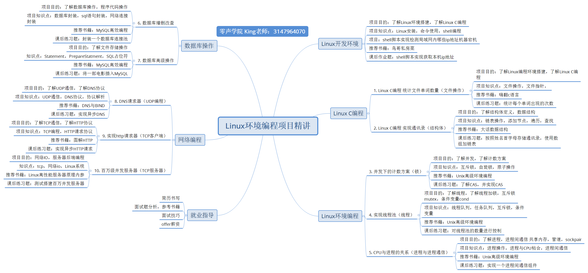

# 一周搞定Linux C和C++
本专栏记录了系统掌握Linux环境编程项目的基础以及学习记录，涵盖从Linux开发环境到Linux C编程等众多实战板块，高效完成

## 学习板块概览
### 1. **Linux开发环境**：
- **项目目的**：安装Linux开发环境、Linux基础命令使用、以及Shell脚本编程。
- **项目内容**：shell脚本实现内网ip宕机地址检测、shell脚本获取本机ip地址
### 2. **Linux C编程**
#### 2.1 **Linux文件操作：统计文件单词数量**
- **项目目的**：介绍C语言操作文件读取、解析以及单词统计等文件操作技巧，提升C/C++文件处理能力。
- **项目内容**：统计文件单词数量、分别统计文件中每一个单词数量
#### 2.2 **结构体应用：实现通讯录**
- **项目目的**：围绕结构体设计和链表操作，完成通讯录系统的搭建，理解面向过程编程中的数据结构组织。
- **项目内容**：按照姓名首字母存储通讯录，使用数组加链表。

### 3. **Linux 环境编程**
#### 3.1 **并发编程：锁机制**
- **项目介绍**：深入讲解并发编程中锁的原理与使用，应对多线程开发中的数据同步问题。
- **项目目的**：了解并发，了解计数方案，了解互斥锁、自旋锁、原子操作
- **项目内容**：实现CAS

#### 3.2 **CPU与进程的关系：进程与进程通信**
- **项目目的**：了解进程操作，进程间通信共享内存，进程与CPU粘合，管道，进程间通信，socket。
- **项目内容**：实现一个进程间通信组件。

#### 3.3 **线程：实习线程池**
- **项目目的**：了解线程，线程队列，任务队列，线程加锁，互斥锁mutex，条件变量cond
- **项目内容**：对线程池的数量进行控制

#### 3.4 **数据库实战：MySQL项目**
- **项目目的**：结合MySQL数据库，了解数据库操作，程序代码操作，数据库封装，sql语句封装，网络连接封装
- **项目内容**：封装一个数据库链接池

### 4. **网络编程**
#### 4.1 **UDP编程：DNS请求器**
- **项目目的**：剖析DNS协议原理，学习如何实现DNS请求，探索网络通信的域名解析机制，了解UDP通信，了解DNS协议
- **项目内容**：实现异步DNS

#### 4.2 **TCP客户端：实现http请求器**
- **项目目的**：了解TCP通信与编程，了解HTTP请求协议
- **项目内容**：实现异步HTTP请求

#### 4.1 **TCP服务器：百万级并发服务器**
- **项目目的**：网络IO，服务器后端编程
- **项目内容**：测试搭建百万并发服务器

学习网站：
[零声教育](url)https://it.0voice.com/p/t_pc/course_pc_detail/video/v_64676afce4b0b0bc2be7dba6?product_id=course_2U9D57IzMfQsoiaMuokdvXYV11c
推荐书籍：
- 《鸟哥私房菜》
- 《嗨翻C语言》
- 《大话数据结构》
- 《Unix高级环境编程》
- 《MySQL高效编程》
- 《DNS与BIND》
- 《图解HTTP》
- 《Linux高性能服务器原理内参》